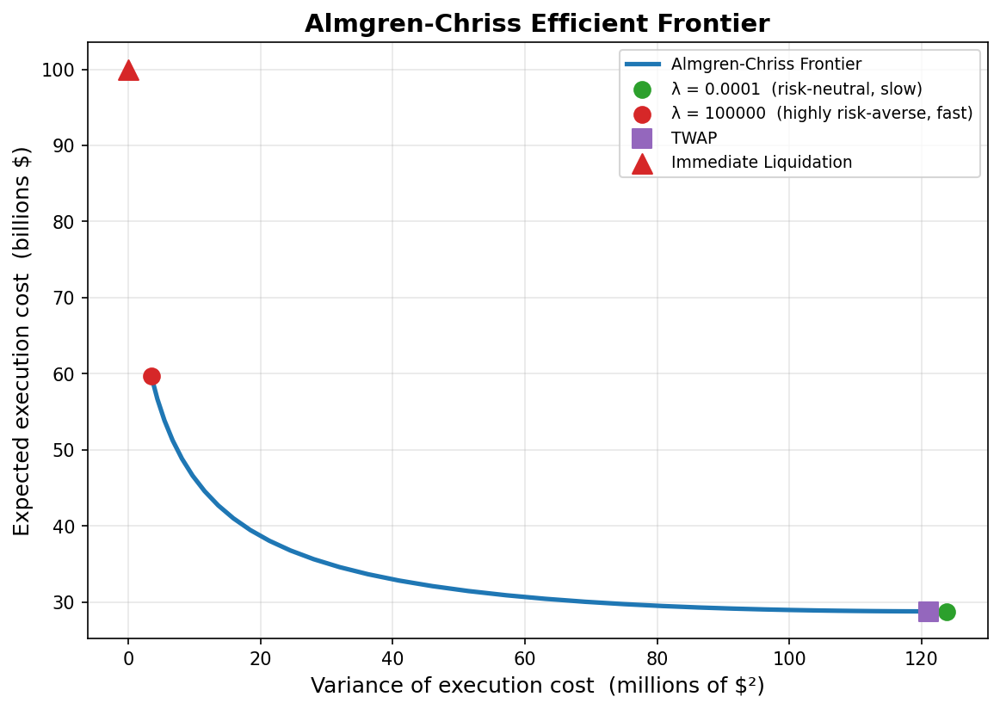
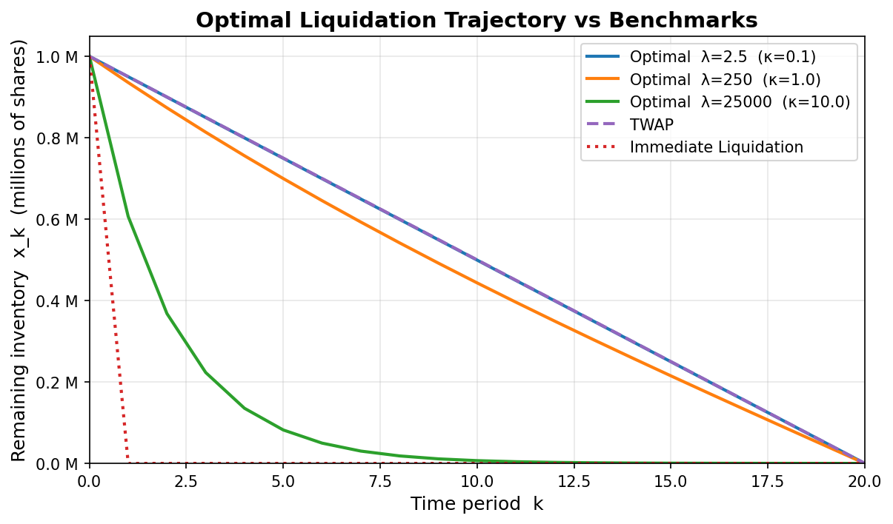
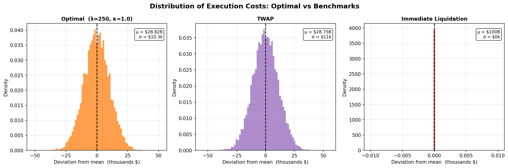
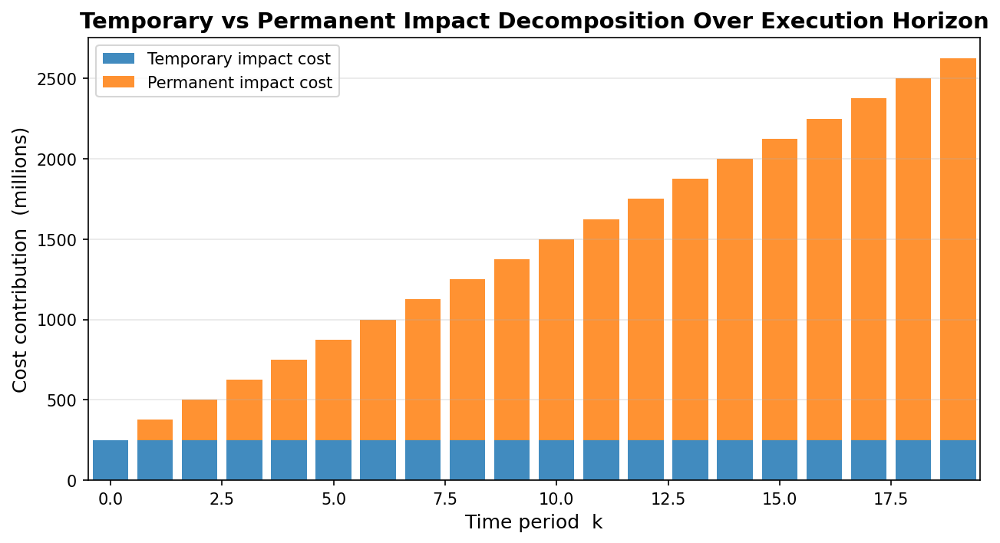
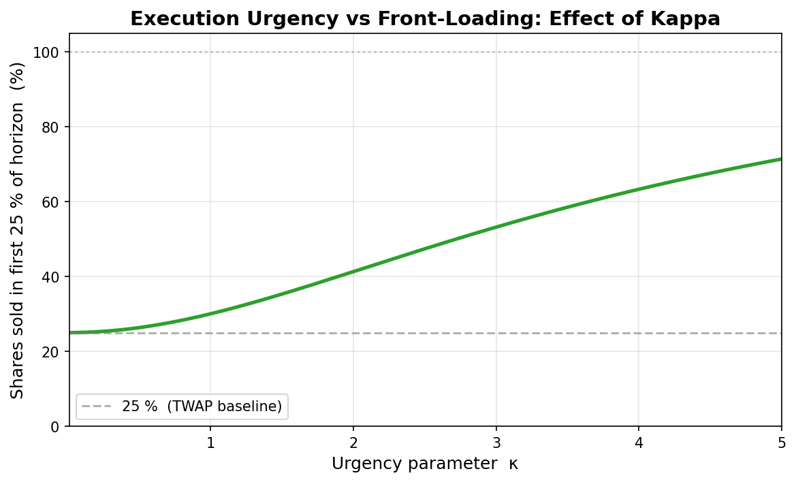

# Almgren-Chriss Execution Analytics Platform

[](https://www.python.org/)
[](https://isocpp.org/)
[](https://streamlit.io/)
[](LICENSE)

A professional, interactive **optimal execution research platform** implementing the Almgren-Chriss (2000) framework.  The platform combines a high-performance C++ Monte Carlo engine with a real-time Streamlit dashboard, live market data from Yahoo Finance, automatic model calibration, and side-by-side strategy comparison across TWAP, VWAP, and Almgren-Chriss optimal execution.

---

## Architecture

```
AC-execution-sim/
│
├── src/                          # C++ simulation engine (core — do not modify)
│   ├── almgren_chriss.cpp        #   Closed-form AC trajectories + MC engine
│   └── almgren_chriss.h
│
├── python/
│   ├── dashboard/
│   │   └── app.py                # Streamlit dashboard (entry point)
│   ├── data/
│   │   └── fetch_data.py         # yfinance market data downloader
│   ├── analytics/
│   │   ├── calibration.py        # Market parameter calibration
│   │   ├── execution_compare.py  # TWAP / VWAP / AC strategy comparison
│   │   └── metrics.py
│   ├── bridge/
│   │   └── simulator_interface.py# Python ↔ C++ subprocess bridge
│   └── requirements.txt
│
├── data/
│   └── market_data/              # Cached CSV downloads
│
├── results/                      # Simulation output artefacts
├── plots/                        # Static diagnostic plots
├── build/                        # CMake build output (gitignored)
└── CMakeLists.txt
```

---

---

## Quick Start

```bash
# 1. Build the C++ engine
cmake -B build -DCMAKE_BUILD_TYPE=Release
cmake --build build --config Release

# 2. Install Python dependencies
pip install -r python/requirements.txt

# 3. Launch the Streamlit dashboard
streamlit run python/dashboard/app.py
```

> **Streamlit Community Cloud**: push the repo and set the main file to
> `python/dashboard/app.py`.  The dashboard falls back to pure-Python
> simulation automatically when the C++ binary is absent.

---

## 1  The Optimal Execution Problem

An institution needs to sell **X** shares by time **T**. Two forces pull in opposite directions:

- **Market impact**: trading quickly in large blocks moves the price against you (temporary and permanent impact costs)
- **Timing risk**: trading slowly keeps you exposed to adverse price drift for longer (variance of execution cost)

The Almgren-Chriss model gives an exact, closed-form schedule that resolves this tension for any desired balance between cost and risk.

---

## 2  The Almgren-Chriss Model

### Objective function

Minimise:

$$\text{Objective} = E[\text{Cost}] + \lambda \cdot \text{Var}[\text{Cost}]$$

where **λ** (lambda) is the trader's risk aversion:

| λ | Behaviour |
|---|---|
| → 0 | Risk-neutral; minimise expected cost only → TWAP-like slow execution |
| → ∞ | Variance-averse; minimise timing risk → sell everything immediately |

### Two types of market impact

| Impact type | Mechanism | Formula |
|---|---|---|
| **Temporary** | Degrades only the execution price of the current trade | $P^{\text{exec}}_k = S_k - \eta v_k$ |
| **Permanent** | Shifts the mid-price for all future trades | $S_{k+1} = S_k - \gamma v_k + \sigma\sqrt{\Delta t}\,Z_k$ |

where $v_k = x_k - x_{k+1}$ is the number of shares sold in period $k$, and $Z_k \sim \mathcal{N}(0,1)$.

### Cost definition (implementation shortfall)

$$\text{Cost} = \sum_{k=0}^{N-1} v_k \left(S_0 - P^{\text{exec}}_k\right) = \sum_{k=0}^{N-1} v_k \left(S_0 - S_k + \eta v_k\right)$$

This measures the shortfall against the decision price $S_0$, capturing both price-drift loss and temporary impact.

### Variance of cost (theoretical)

$$\text{Var}[\text{Cost}] = \sigma^2 \sum_{k=1}^{N} x_k^2 \,\Delta t$$

---

## 3  Closed-Form Solution

The optimal inventory schedule is:

$$x_k = X \cdot \frac{\sinh\!\left(\kappa(T - t_k)\right)}{\sinh(\kappa T)}, \qquad t_k = k\,\Delta t$$

where the **urgency parameter** $\kappa$ is:

$$\kappa = \sqrt{\frac{\lambda\,\sigma^2}{\eta}}$$

**Intuition for κ:**

- $\kappa$ measures how aggressively the trader should front-load execution.
- Small $\kappa$ → $\sinh(\kappa u)/\sinh(\kappa T) \to u/T$ (l'Hôpital) → uniform TWAP schedule.
- Large $\kappa$ → exponential decay → most shares sold in the first few periods.
- $\kappa$ rises with **λ** (more risk-averse) and **σ** (more volatile), falls with **η** (lower impact per share).

With the default parameters ($\sigma=0.02$, $\eta=0.1$), the ratio $\sigma^2/\eta = 0.004$ is small, so visible front-loading only appears for $\lambda \gtrsim 100$ (giving $\kappa \gtrsim 0.63$).

---

## 4  Efficient Frontier

Every point on the efficient frontier corresponds to one value of λ.  The curve
traces the minimum achievable variance for each level of expected cost.  No
strategy below and to the left of the curve is achievable; strategies above and
to the right are suboptimal.



The frontier runs from the TWAP anchor (bottom-right: low expected cost, high
variance) to the Immediate anchor (top-left: maximum expected cost, zero variance).
Any point off the curve—for instance, a poorly-timed ad hoc schedule—is
dominated by some point on the curve with both lower cost *and* lower variance.

---

## 5  Results

### Optimal Liquidation Trajectory vs Benchmarks



Three Almgren-Chriss trajectories bracket the benchmark strategies.  At κ = 0.1
(λ = 2.5) the optimal schedule is nearly identical to TWAP—the cost of holding
inventory overnight is so small that spreading trades evenly is near-optimal.  At
κ = 1.0 (λ = 250) a convex curve emerges: more shares are liquidated in early
periods, trading some execution price concession to reduce the number of periods
with large open inventory.  At κ = 10 (λ = 25 000) execution is extremely
front-loaded—over 90 % of shares are gone within the first five periods—
approaching Immediate Liquidation in character.

---

### Distribution of Execution Costs: Optimal vs Benchmarks



Each subplot shows the centred distribution (deviation from mean) across 10 000
Monte Carlo paths.  **Optimal (λ = 250, κ ≈ 1.0)** has mean \$28.82 B and σ ≈
\$10.3 k: the front-loading slightly raises expected cost versus TWAP but narrows
the distribution.  **TWAP** has mean \$28.75 B and σ ≈ \$11 k—a slightly wider
spread reflecting greater exposure to price drift over the full horizon.
**Immediate Liquidation** is exactly deterministic (σ = \$0) at \$100 B because
all randomness enters after the single sell trade, contributing nothing to the
cost; the cost is entirely determined by the colossal temporary impact η X².

---

### Temporary vs Permanent Impact Decomposition Over Execution Horizon



For the optimal strategy at λ = 0.1 (TWAP-like), temporary impact per period
(blue) is nearly constant—reflecting roughly uniform trade sizes.  Permanent impact
(orange) grows monotonically: each successive period carries a larger fraction of
the cumulative price depression $\gamma(X - x_k)$ accumulated by all prior trades.
This is the key asymmetry of the model: permanent costs are heaviest at the *end*
of execution (when the price has been depressed the most), while temporary costs
are proportional to current trade size only.

---

### Execution Urgency vs Front-Loading: Effect of Kappa



The purely analytical curve shows how κ controls front-loading.  For κ → 0 the
schedule is perfectly uniform: exactly 25 % of shares are sold in the first 25 %
of the horizon (matching the TWAP baseline, dashed).  As κ increases, the
exponential sinh profile accelerates early sales.  At κ = 2 roughly 55 % of
shares are gone by the 25 % mark; at κ = 5, over 70 %.  This monotone
relationship makes κ an intuitive "dial" for a trader deciding how urgently to
liquidate: any desired front-loading fraction maps to a unique κ, which in turn
maps to a unique λ.

---

## 6  Parameters Used

| Parameter | Symbol | Default | Description |
|---|---|---|---|
| Initial price | $S_0$ | 100.0 | Mid-price at decision time |
| Volatility | $\sigma$ | 0.02 | ABM diffusion coefficient (price/√time) |
| Horizon | $T$ | 1.0 | Total execution time |
| Periods | $N$ | 20 | Number of equal-length intervals |
| Total shares | $X$ | 1 000 000 | Position to liquidate |
| Temporary impact | $\eta$ | 0.1 | Cost coefficient: $\eta v_k^2$ per period |
| Permanent impact | $\gamma$ | 0.05 | Price shift per share: $\gamma v_k$ |
| Risk aversion | $\lambda$ | 0.1 (default); swept for frontier | E[Cost]-Var tradeoff weight |

> **Note on scale**: With X = 1 000 000 and η = 0.1, the immediate liquidation
> cost is η X² = \$100 B—far exceeding the \$100 M portfolio value.  These are
> deliberately extreme parameters chosen to make all model behaviours visible on
> a single plot.  Realistic institutional parameters would use γ, η ≈ 10⁻⁶–10⁻⁵.

---

---

## 7  How to Run

### Prerequisites

| Tool | Version tested |
|---|---|
| CMake | ≥ 3.10 |
| C++ compiler | clang++ 22 / MSVC 19.44 / g++ ≥ 9 |
| Python | ≥ 3.11 |
| See `python/requirements.txt` for Python package versions |

### Build the C++ simulation engine

```bash
cmake -B build -DCMAKE_BUILD_TYPE=Release
cmake --build build --config Release
```

Binary: `build/almgren_chriss` (Linux/macOS) or `build/Release/almgren_chriss.exe` (Windows).

**Manual build (without CMake):**
```bash
g++ -O2 -std=c++17 src/almgren_chriss.cpp -o almgren_chriss
```

### Verify the binary

```bash
# Print 21 inventory levels: first = 1000000, last = 0
./build/almgren_chriss trajectory optimal 100 0.02 1.0 20 1000000 0.1 0.05 0.1

# Print: <mean_cost> <variance>
./build/almgren_chriss montecarlo twap 100 0.02 1.0 20 1000000 0.1 0.05 0.1 1000
```

### Install Python dependencies

```bash
pip install -r python/requirements.txt
```

### Launch the interactive dashboard

```bash
streamlit run python/dashboard/app.py
```

Open [http://localhost:8501](http://localhost:8501) in your browser.

### Fetch live market data (standalone)

```bash
python python/data/fetch_data.py --ticker AAPL --period 5d --interval 1m
```

### Generate static diagnostic plots

```bash
python python/visualize.py
```

### Deploying to Streamlit Community Cloud

1. Push repository to GitHub.
2. Connect to [share.streamlit.io](https://share.streamlit.io).
3. Set **Main file path** → `python/dashboard/app.py`.
4. Streamlit Cloud will install `python/requirements.txt` automatically.
5. Without a compiled binary, the dashboard uses the pure-Python Monte Carlo fallback.

---

## 8  Dashboard Screenshots

| Section | Description |
|---|---|
| Historical Market Data | Live OHLCV chart with volume bars |
| Optimal Trajectories | Inventory schedules: AC vs TWAP vs VWAP |
| Monte Carlo Paths | Simulated price paths with ±1σ band |
| Cost Distribution | Histogram overlay — all strategies |
| Strategy Comparison | Side-by-side cost / shortfall table |
| Efficient Frontier | E[Cost] vs Var[Cost] parametric curve |
| Execution Analytics | Per-period trade schedule + cumulative cost |

---

## 9  References

R. Almgren and N. Chriss, *"Optimal Execution of Portfolio Transactions"*,
**Journal of Risk**, Vol. 3 No. 2, pp. 5–39, Winter 2000/2001.  
[https://doi.org/10.21314/JOR.2001.041](https://doi.org/10.21314/JOR.2001.041)

R. Almgren, *"Optimal Trading Strategies with Stochastic Liquidity"*,
**Journal of Financial Markets**, 2003.

---
